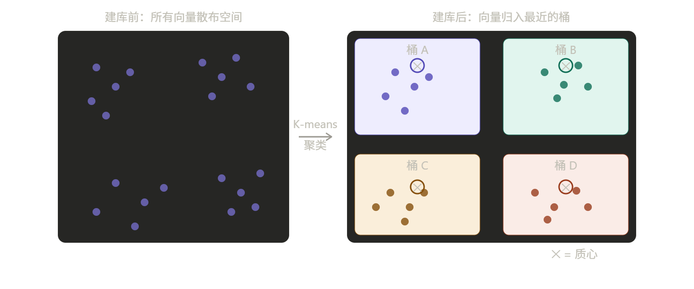
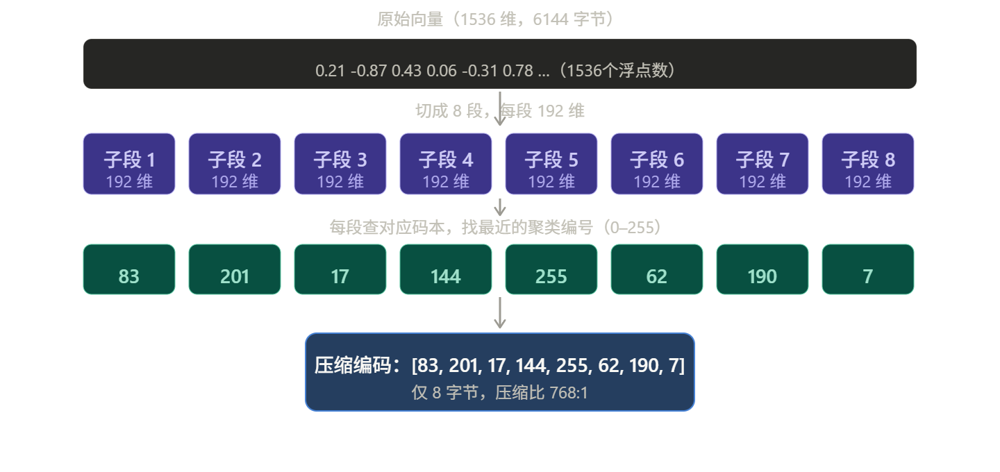
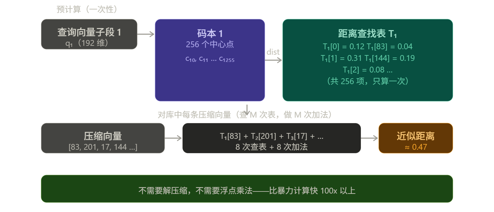
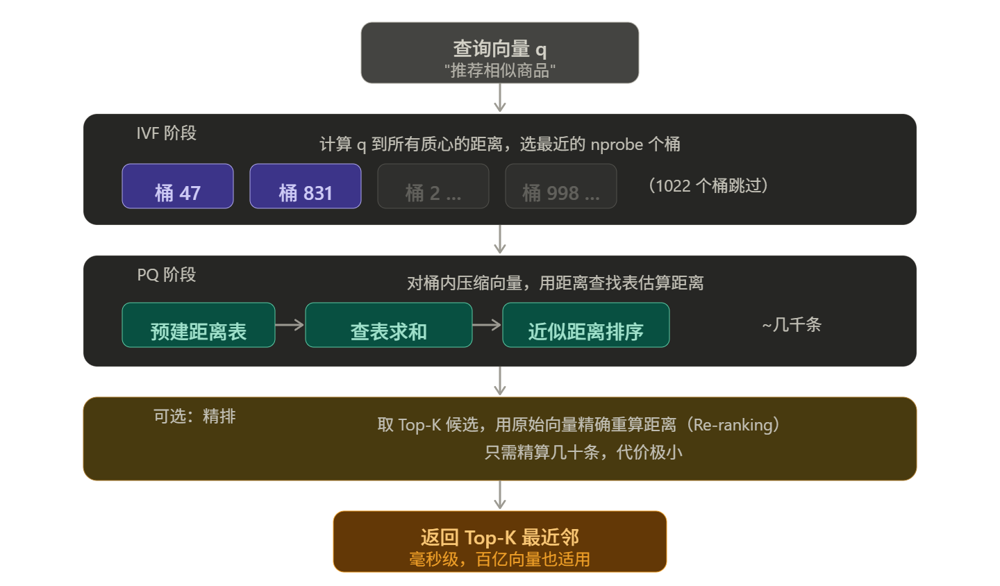

IVFPQ 是一种向量近似最近邻搜索算法，全称是 **Inverted File Index + Product Quantization**，把两种技术组合在一起，专门解决"在海量高维向量里快速找到最相似的那个"问题。

在讲 IVFPQ 之前，先理解一个核心矛盾：向量数据库里可能存着几亿条向量，每条有 1536 个维度。暴力枚举每一条来计算距离，根本来不及。IVFPQ 的思路是：**先粗筛，再压缩，最后精排。**

两个技术各司其职。先来看第一个——IVF。

### 第一部分：IVF（倒排文件索引）—— 粗筛

**类比：** 图书馆找书。你不会从第一排书架翻到最后一排，你先看分类标签（文学/科技/历史），锁定一两个区域，再在那个区域里找。IVF 的"桶"就是这个分类区域。

**建库阶段：** 用 K-means 把所有向量聚成 N 个簇（比如 1024 个），每个簇有一个"质心"。每条向量被分配到最近的那个簇里，存进对应的"桶"。

**查询阶段：** 来了一个查询向量，先计算它离哪几个质心最近，只进入那几个桶（比如 nprobe=8，就只看 8 个桶）。假设一共 1024 个桶，就直接跳过了 99% 的数据。

---

### 第二部分：PQ（乘积量化）—— 压缩 + 快速估距

IVF 帮我们把搜索范围缩小到几个桶，但桶里还有成千上万条向量。每条 1536 维的浮点向量占 **6KB 内存**，直接比较还是很慢。PQ 解决这个问题。

**核心思路：** 把一条长向量切成 M 段，每段单独量化，用一个很小的编码（比如 1 字节）代表原来几百维的浮点数。

**类比：** 你要记住一张人脸。与其记下每个像素（太多），不如记"发型：短发、肤色：偏白、脸型：方脸"——用几个离散的描述词来近似还原这张脸。PQ 就是对向量做这件事。

6144 字节变成 8 字节，压缩了 768 倍。但关键问题来了：压缩了怎么还能算距离？

---

### 第三部分：PQ 的秘密武器——距离查表

不需要解压缩再算！利用**预计算距离表（Distance Table）**，把计算变成查表。

查询来了，先把查询向量也切成 M 段，对每段和对应码本的所有 256 个中心点预算好距离，填一张表。之后对库里任意一条压缩向量，距离 = 查 M 次表再相加，超级快。

### 第四部分：IVF + PQ 组合全流程

两个技术合体，就是 IVFPQ 的完整工作流程：

### 关键参数小结

理解了原理，实际使用 IVFPQ（比如 Faiss 库）时你会遇到三个核心参数：

|参数|含义|调大效果|
|---|---|---|
|`nlist`|桶的数量（IVF 质心数）|每桶更小，粗筛更精准，但建库变慢|
|`nprobe`|查询时进几个桶|召回率提升，速度变慢|
|`M`（子段数）|PQ 切多少段|精度提升，内存略增|

**一句话总结：** IVF 告诉你"去哪里找"，PQ 告诉你"用什么方式快速找"——两者叠加，让海量向量检索在毫秒内完成。这也是 Faiss、Milvus、Weaviate 等向量数据库的核心索引方案。