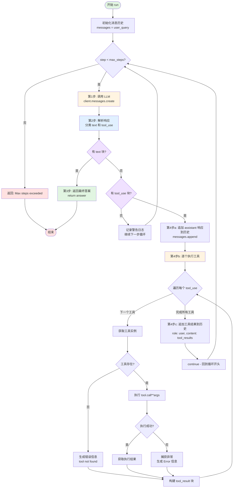

```mermaid
graph TB
    Start([开始 run]) --> Init[初始化消息历史<br/>messages = user_query]
    Init --> LoopStart{step < max_steps?}
    
    LoopStart -->|否| MaxStepsExceeded[返回: Max steps exceeded]
    MaxStepsExceeded --> End([结束])
    
    LoopStart -->|是| Step1[第1步: 调用 LLM<br/>client.messages.create]
    
    Step1 --> ParseResponse[第2步: 解析响应<br/>分类 text 和 tool_use]
    
    ParseResponse --> CheckText{有 text 块?}
    
    CheckText -->|是| ReturnAnswer[第3步: 返回最终答案<br/>return answer]
    ReturnAnswer --> End
    
    CheckText -->|否| CheckTool{有 tool_use 块?}
    
    CheckTool -->|否| Warning[记录警告日志<br/>继续下一步循环]
    Warning --> LoopStart
    
    CheckTool -->|是| Step4a[第4步a: 追加 assistant 响应到历史<br/>messages.append]
    
    Step4a --> ExecuteTools[第4步b: 逐个执行工具]
    
    ExecuteTools --> ToolLoop{遍历每个 tool_use}
    
    ToolLoop -->|下一个工具| GetTool[获取工具实例]
    
    GetTool --> ToolExists{工具存在?}
    
    ToolExists -->|否| ToolNotFound[生成错误信息<br/>tool not found]
    ToolNotFound --> BuildResult[构建 tool_result 块]
    
    ToolExists -->|是| CallTool[执行 tool.call**args]
    
    CallTool --> CallSuccess{执行成功?}
    
    CallSuccess -->|是| GetResult[获取执行结果]
    GetResult --> BuildResult
    
    CallSuccess -->|否| GetError[捕获异常<br/>生成 Error 信息]
    GetError --> BuildResult
    
    BuildResult --> ToolLoop
    
    ToolLoop -->|完成所有工具| AppendResults[第4步c: 追加工具结果到历史<br/>role: user, content: tool_results]
    
    AppendResults --> ContinueLoop[continue - 回到循环开头]
    ContinueLoop --> LoopStart
    
    style Start fill:#e1f5e1
    style End fill:#ffe1e1
    style ReturnAnswer fill:#e1f5e1
    style MaxStepsExceeded fill:#ffe1e1
    style Step1 fill:#fff4e1
    style ExecuteTools fill:#fff4e1
    style ParseResponse fill:#e1f0ff
    style CheckText fill:#f0e1ff
    style CheckTool fill:#f0e1ff
```
