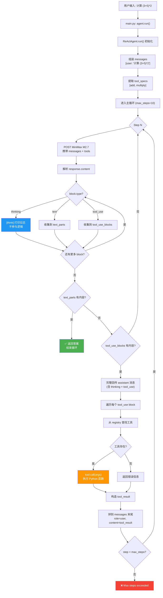
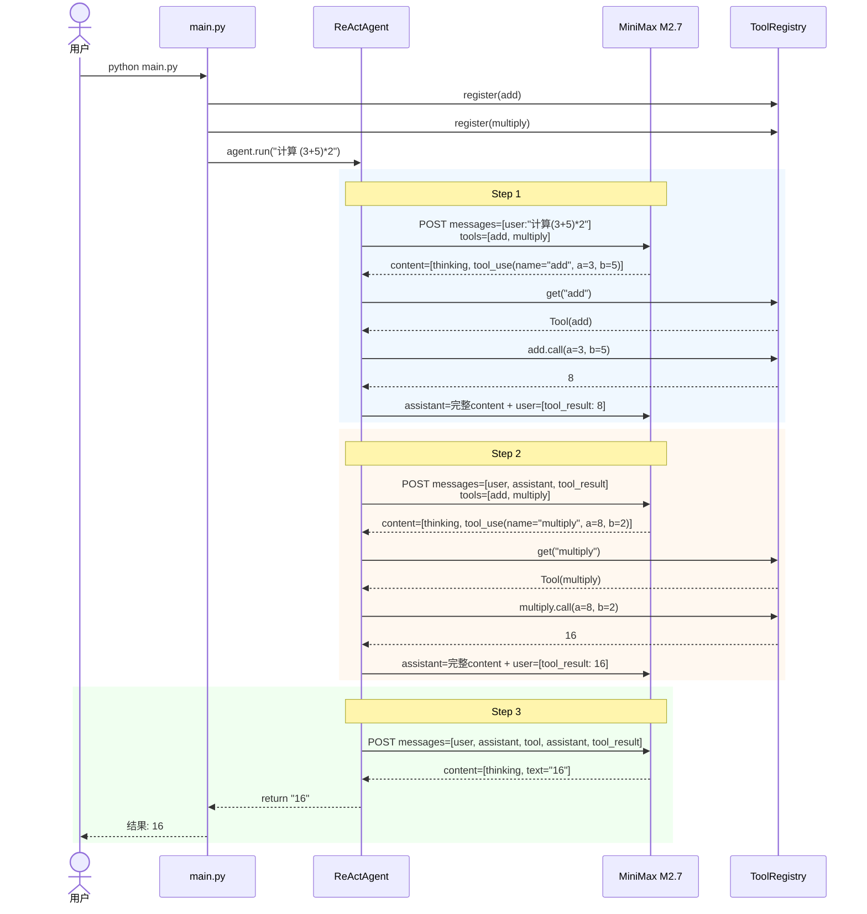
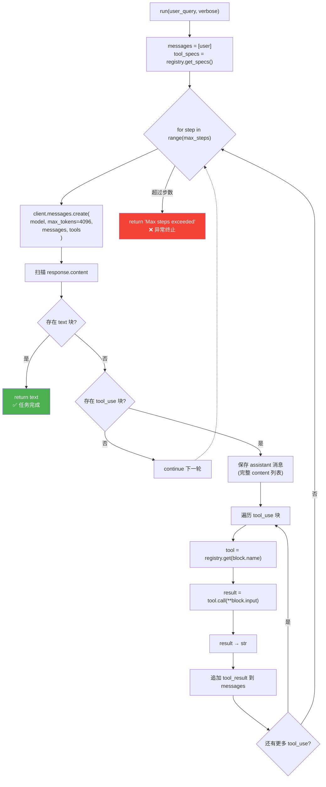
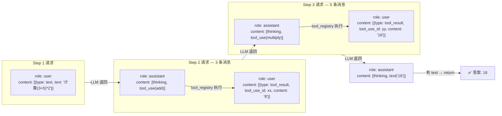

# ReAct Agent 执行流程图

## 总览



## 以 "计算 (3+5)*2" 为例的完整追踪



## run() 内部决策树



## 消息结构演变



## 文件关系

```mermaid
flowchart TD
    subgraph "入口"
        MAIN["main.py<br/>注册工具 + 启动 agent"]
        ENV[".env<br/>MINIMAX_API_KEY"]
    end

    subgraph "agents/tools.py"
        TOOL["Tool<br/>包装 Python 函数<br/>生成 anthropic_spec"]
        DECO["@tool 装饰器"]
        REG["ToolRegistry<br/>注册表: 按名存取"]
    end

    subgraph "agents/react.py"
        RACT["ReActAgent<br/>主循环 + 消息管理"]
    end

    ENV -->|load_dotenv| MAIN
    MAIN -->|register| REG
    MAIN -->|ReActAgent(tools=)| RACT

    TOOL -.->|"@tool 调用"| DECO
    TOOL -->|存储| REG
    REG -->|get_specs| RACT
    REG -->|get(name)| RACT
    RACT -->|anthropic.Anthropic| LLM["MiniMax M2.7<br/>api.minimaxi.com/anthropic"]

    style MAIN fill:#e3f2fd
    style RACT fill:#fff3e0
    style REG fill:#f3e5f5
    style LLM fill:#e8f5e9
```
