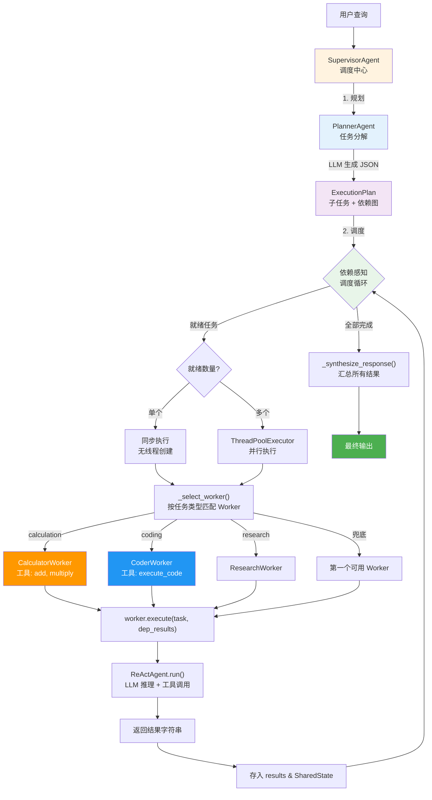
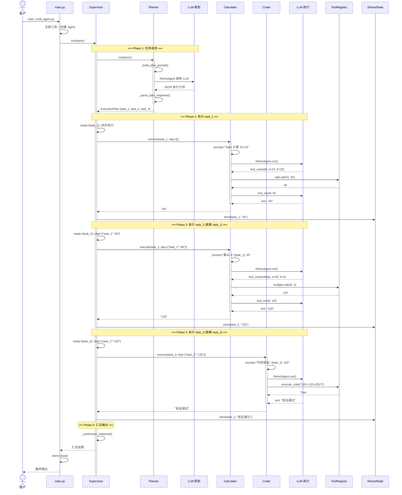
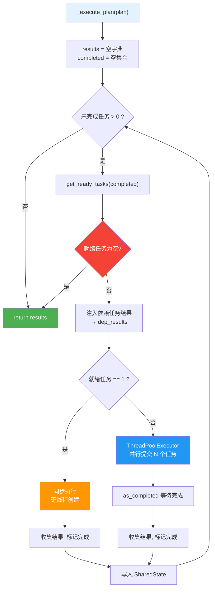
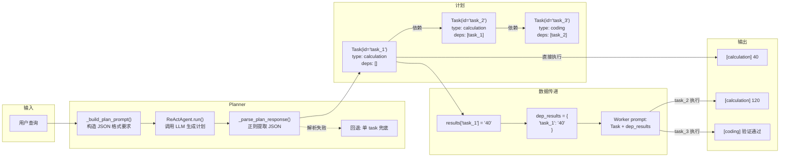
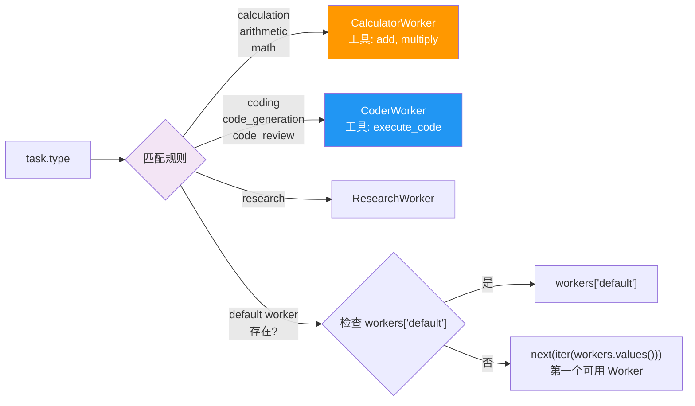

# 多 Agent 协作执行流程

## 架构总览

## 完整执行流程（以 "先计算 15+25，然后乘以 3，最后用代码验证结果" 为例）

## 依赖感知调度算法

## 消息与数据流

## Worker 类型映射

## 关键设计决策

| 决策 | 说明 |
|------|------|
| **前置结果注入** | `_execute_plan` 在提交任务前从 `results` 提取依赖任务结果，通过 `dep_results` 传入 Worker，写入 prompt 让 LLM 看到上游输出 |
| **类型自动转换** | `Tool.call()` 根据函数签名的类型注解（`a: int`）自动将 LLM 传来的字符串参数转为对应类型，防止 `"40" * "3"` 之类的错误 |
| **单任务不走线程池** | `ready_tasks == 1` 时直接同步执行，避免创建无用 daemon 线程，同时规避 PyCharm + Python 3.13 线程清理异常 |
| **JSON 解析容错** | Planner 用正则提取 LLM 响应中的 JSON，解析失败时回退为单个通用 task，保证系统不崩溃 |
| **共享 Anthropic Client** | 所有组件共用同一个 client 实例，减少 httpx 连接池和 daemon 线程数量 |
| **优雅关闭** | 脚本结束前调用 `client.close()` 显式关闭连接池、join 所有线程 |
