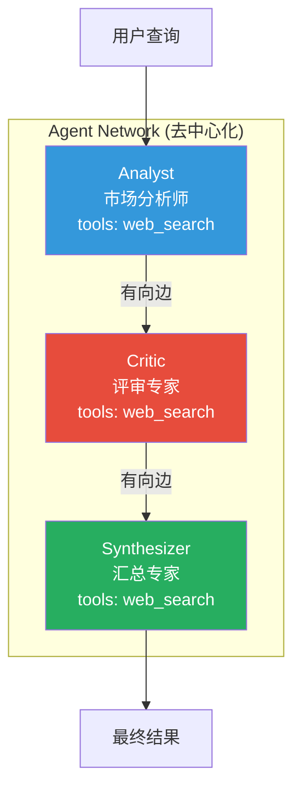
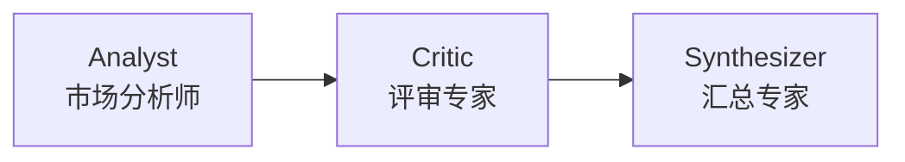
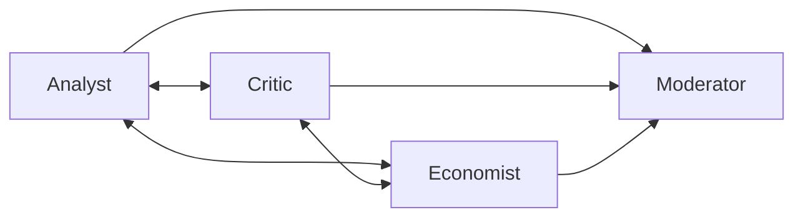
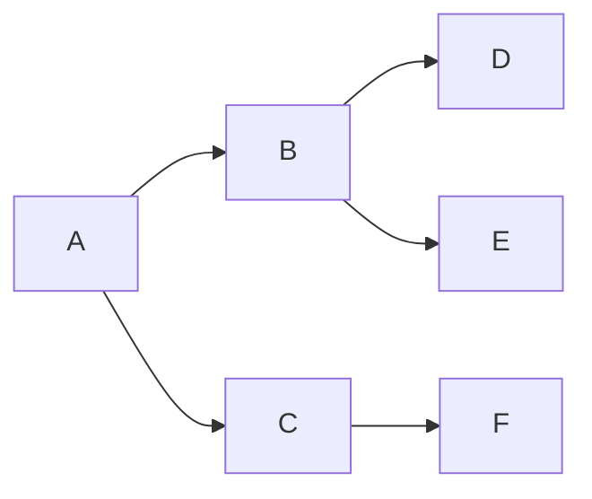
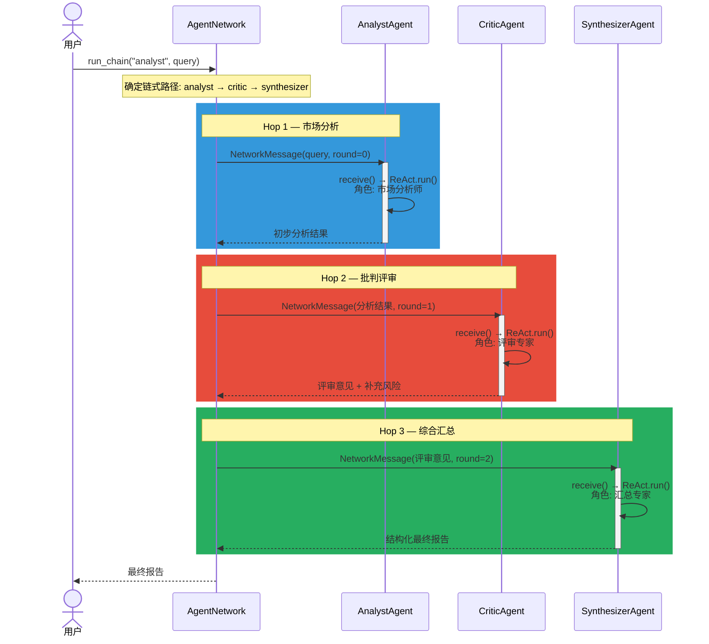
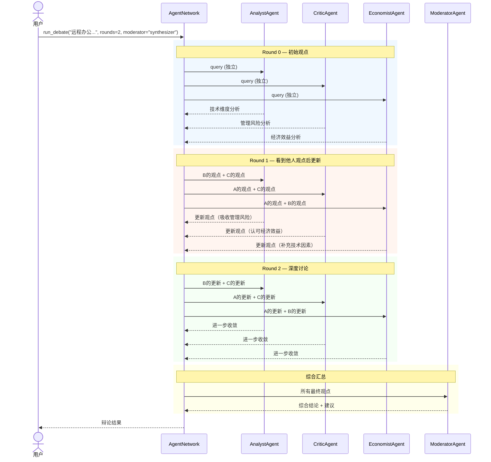
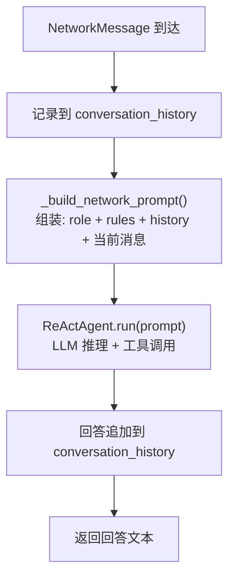

# Multi-Agent Networks —— 去中心化多 Agent 协作

## 概述

Multi-Agent Networks 是一种**去中心化**的多 Agent 通信模式。与 Supervisor 模式（中心调度）不同，Network 模式中的 Agent 通过有向边直接通信，消息沿边传递，没有统一的协调者。

核心思想：**每个 Agent 扮演一个角色，从自己的视角处理消息，然后传递给邻居节点**。

## 架构总览



## 核心数据结构

### NetworkAgent

```python
class NetworkAgent(WorkerAgent):
    name: str                # 节点名称（如 "analyst"）
    role: str                # 角色描述（如 "市场分析师"）
    neighbors: list[str]     # 可转发消息的邻居列表
    conversation_history: list[dict]  # 会话历史
```

### NetworkMessage

```python
@dataclass
class NetworkMessage:
    sender: str       # 发送方
    receiver: str     # 接收方（"all" = 广播）
    content: str      # 消息内容
    round_num: int    # 轮次编号
    msg_type: str     # query / response / opinion / final
    timestamp: float  # 时间戳
```

### AgentNetwork

```python
class AgentNetwork:
    agents: dict[str, NetworkAgent]        # 节点注册表
    adjacency: dict[str, list[str]]        # 邻接表（有向边）

    # 执行模式
    run_chain(start, query) -> str         # 链式传递
    run_debate(query, rounds, moderator)   # 辩论模式
    run_broadcast(start, query) -> dict    # BFS 广播
```

## 三种拓扑模式

### 1. 链式 (Chain)



- 消息沿单向链**顺序传递**
- 每个节点基于上游输出来精炼
- 适用：渐进式分析、分级审核、多轮精炼

### 2. 辩论 (Mesh)



- 所有参与者**全连接**，每轮互相分享观点
- 多轮讨论后观点**逐步收敛**
- 最后由 moderator **综合汇总**
- 适用：争议问题、需要多视角的决策

### 3. 广播 (Broadcast)



- BFS 遍历所有可达节点
- 每个节点处理后转发给邻居
- 收集所有节点的独立响应
- 适用：信息收集、多方评估、舆情分析

## 链式执行时序



## 辩论执行时序



## NetworkAgent.receive() 内部流程



## 与 Supervisor 模式对比

| 维度 | Supervisor 模式 | Network 模式 |
|------|----------------|-------------|
| 协调方式 | 集中式（Supervisor 统一调度） | 去中心化（P2P 消息驱动） |
| 拓扑结构 | 星型（Supervisor 为中心） | 灵活（链式/网格/广播/自定义） |
| 任务分解 | Planner 生成结构化 JSON Task | 无 Planner，每个 Agent 自行理解消息 |
| 执行模式 | 依赖感知调度 + 并行 | 链式传递 / 轮次辩论 / BFS 广播 |
| 消息格式 | AgentMessage + Task | NetworkMessage（更简单） |
| 并行度 | 依赖无关 Task 可并行 | 取决于拓扑（链式串行，辩论轮次内并行） |
| 适用场景 | 确定性任务分解（已知步骤） | 开放讨论、多视角分析、探索性推理 |
| 状态管理 | SharedState（集中 KV 存储） | conversation_history（每个节点独立） |
| 记忆 | AgentMemory（跨会话持久化） | 无（conversation_history 仅会话内） |
| 容错性 | Supervisor 单点 | 高（各节点独立，无单点） |
| API 调用量 | Task 数 × 1 次/Worker | 取决于拓扑和轮次 |

## 组合使用

两种模式可以组合 —— Network 中的某个节点可以是 PlanAndSolveWorker：

```
AgentNetwork
  ├── analyst (NetworkAgent)
  │     └── 内部链式分析
  ├── CalculatorNode (PlanAndSolveWorker + NetworkAdapter)
  │     └── 内部 P&S 推理
  └── synthesizer (NetworkAgent)
        └── 汇总所有输出
```

## 适用场景

- **需要多视角讨论的开放问题** — 辩论模式，每个 Agent 从不同角色分析
- **渐进式多轮精炼** — 链式模式，每一步在上一轮基础上深化
- **分布式信息收集** — 广播模式，多个 Agent 独立处理同一问题的不同方面
- **模拟团队讨论** — 组合链式和辩论，先各自分析、再互相评审、最后汇总

## 不适合场景

- 确定性多步骤任务（用 Supervisor + Planner 更高效）
- 简单的单步工具调用（用普通 ReActAgent 即可）
- 需要结构化依赖管理的任务（Network 没有依赖图）
