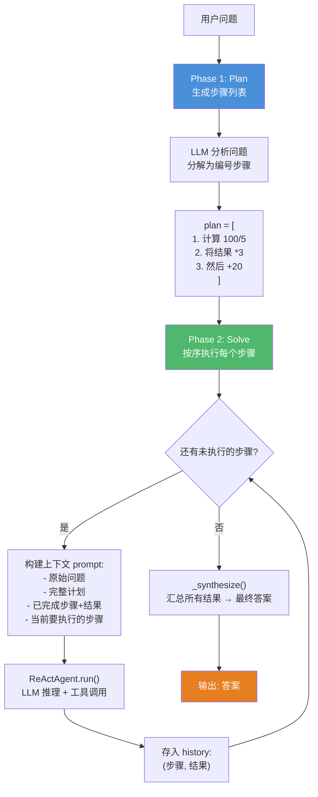
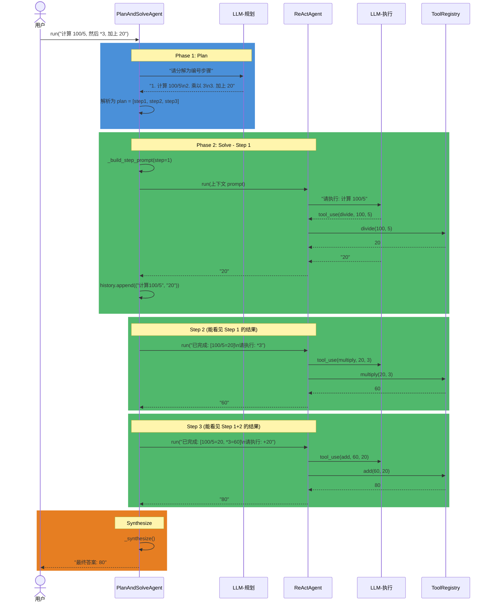

# Plan-and-Solve (P&S)

## 概述

Plan-and-Solve 是 Wang et al. (2023) 提出的两阶段推理策略。核心思想：**先看清全貌再动手**。

与 ReAct（边想边做）不同，P&S 强制 LLM 先生成完整的步骤计划，然后按序执行，每步都能看到完整计划和已完成步骤的结果。

## 架构



## 完整执行时序



## 关键设计

### Step Prompt 结构

每一步发给 LLM 的 prompt 包含四部分：

```
Original problem: 计算 100/5, 然后 *3, 加上 20

Full plan:
  Step 1: 计算 100/5
  Step 2: 将结果乘以 3
  Step 3: 将结果加上 20

Completed steps and their results:
  Step 1 [计算 100/5]: 20

Now execute ONLY Step 2: 将结果乘以 3

Remaining steps (do NOT execute these yet):
  Step 3: 将结果加上 20
```

关键点：LLM 知道前面做了什么、下一步做什么、还有什么没做。避免了多 Agent 系统中前置结果丢失的问题。

### 与 Multi-Agent 的对比

| 维度 | Plan-and-Solve | Multi-Agent (Supervisor) |
|------|---------------|--------------------------|
| 规划方式 | LLM 文本列表 | Planner 生成 JSON Task |
| 执行单元 | 同一 Agent 循环 | 不同 Worker Agent |
| 上下文传递 | 累积 history | dep_results 注入 |
| 并行执行 | 不支持（串行） | 支持（依赖图） |
| 适合场景 | 线性推理 | 复杂依赖 + 并行 |

### 容错

- `_generate_plan()` 解析失败时，按行拆分 LLM 响应，每个非空行当作一个步骤
- 每步执行使用独立的 `ReActAgent` 实例，避免消息历史混乱
