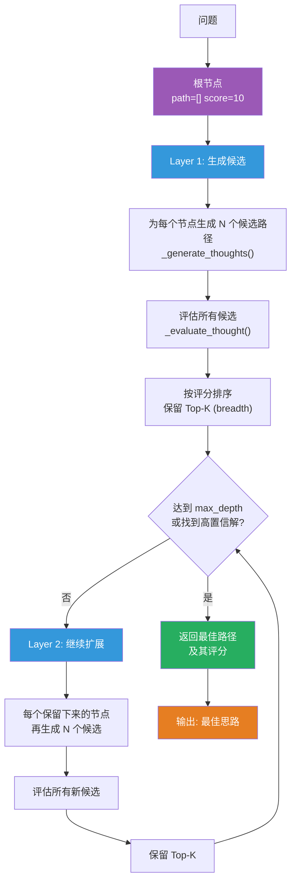
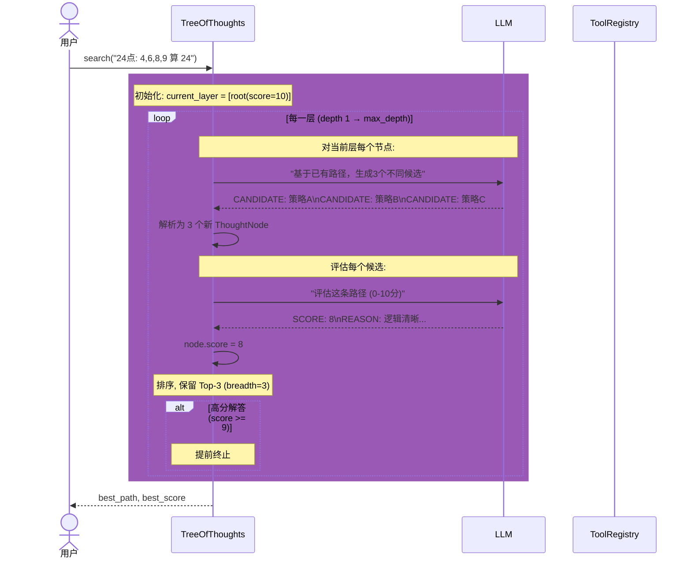

# Tree of Thoughts (ToT)

## 概述

Tree of Thoughts 是 Yao et al. (2023) 提出的思维树搜索框架。核心思想：**不只有一条思路，同时探索多条路径，选最优的继续**。

与 ReAct 不同，ToT 在每一步都生成多个候选思考方向，用 LLM 评估每个方向的质量，只保留高分路径继续扩展。类似人类解题时的"如果这条不行就换一条"。

## 架构



## BFS 搜索流程



## 关键数据结构

### ThoughtNode

```python
@dataclass
class ThoughtNode:
    path: list[str]     # 从根到当前的思考链
                        # 如 ["尝试 8*6=48", "48/4=12", "12+? 不行"]
    score: float        # 质量评分 0-10
    depth: int          # 当前深度（第几步）
    evaluation: str     # LLM 的评估理由
```

### 搜索参数

| 参数 | 含义 | 典型值 |
|------|------|--------|
| `breadth` | 每层保留的最优节点数（BFS 宽度） | 3 |
| `candidates` | 每个节点生成多少候选扩展 | 3 |
| `max_depth` | 最大搜索深度 | 5 |
| `min_score` | 保留节点的最低评分 | 5.0 |

### 搜索过程示意

```
Depth 1:                    [root]
                              │
                    ┌─────────┼─────────┐
                    8*6=48   6+8=14   9-4=5
                   (7分)    (5分)    (4分)
                              │
                  保留 Top-3: 48★, 14, 5
                              │
Depth 2:             ┌───────┼───────┐
                   48/4=12  14+?    5*?
                  (8分)    (3分)   (6分)
                              │
                  保留 Top-3: 12★, 5*?★
                              │
Depth 3:             ┌───────┼───────┐
                 12+12=24 12+9=21  5*4=20...
                 (9分)★  (4分)   (3分)
                              │
                   找到高置信解! 返回
```

## 两个 LLM 调用

### 1. 生成候选 (`_generate_thoughts`)

Prompt 要求 LLM 基于已有路径生成 N 个**不同的**下一步：

```
Problem: 24点游戏: 用 4,6,8,9 算出 24

So far:
  Step 1: 尝试 8*6=48

Now generate 3 DIFFERENT possible next steps:
CANDIDATE: 48/4=12, 然后...
CANDIDATE: 尝试另一条路: 9-4=5...
CANDIDATE: ...
```

### 2. 评估思维 (`_evaluate_thought`)

Prompt 要求 LLM 评分并解释：

```
Problem: 24点游戏...

Evaluate this reasoning path:
  Step 1: 8*6=48
  Step 2: 48/4=12
  Step 3: 12+12=24

SCORE: 9
REASON: 逻辑正确，每个数字用了一次，得到了 24
```

## 与 ReAct 的对比

| 维度 | ReAct | Tree of Thoughts |
|------|-------|-----------------|
| 搜索方式 | 单链 | 树状 BFS |
| 回溯 | 不支持 | 天然支持（评分低就丢弃） |
| 多样性 | 一条路走到黑 | 同时探索 3~5 条路 |
| API 调用 | 少（线性） | 多（每层 breadth*candidates 次评估） |
| 适合场景 | 简单工具调用 | 需要多策略尝试的难题 |

## 适用场景

- **数学/逻辑难题** — 24 点、数独、逻辑推理（需要尝试多种策略）
- **创意生成** — 写诗、起名（多个候选择优）
- **代码调试** — 多个 fix 方向并行探索

## 不适合场景

- 简单的工具调用 — API 开销大得不偿失
- 确定性任务 — 不需要多路径探索
